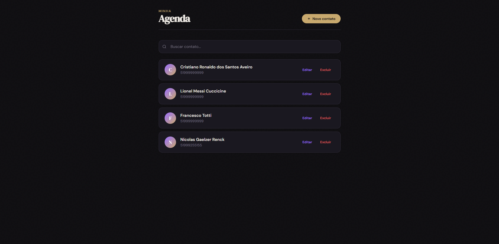
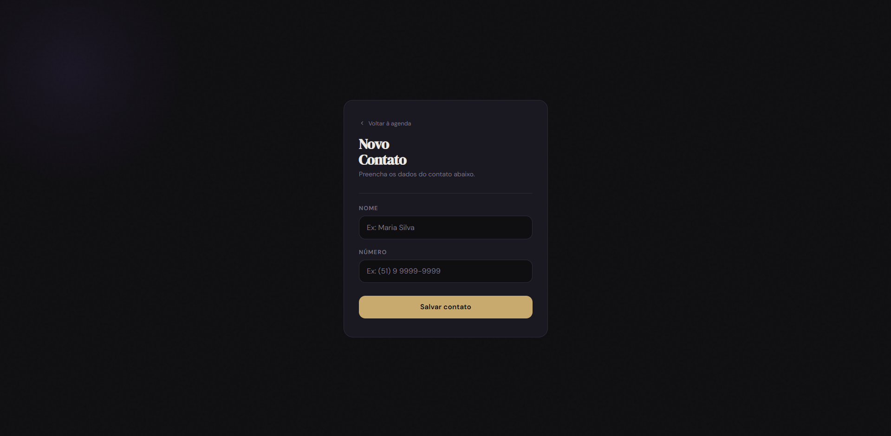
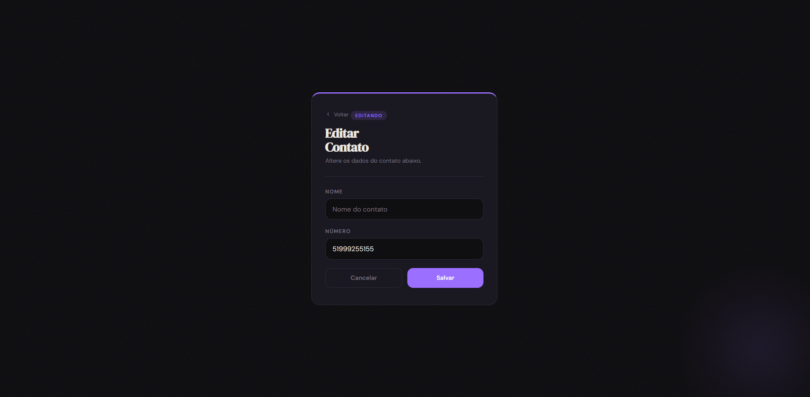

# Agenda Telefônica

Aplicação web para gerenciamento de contatos desenvolvida com Django.
Cada usuário acessa e gerencia apenas os seus próprios contatos.

## Funcionalidades

- Cadastro e login de usuários
- Adicionar, editar e excluir contatos
- Busca de contatos por nome
- Avatar gerado automaticamente pela inicial do contato
- Acesso restrito por autenticação

## Tecnologias

- Python 3 + Django (Class-Based Views)
- HTML5 + CSS3
- SQLite
- Django Contrib Auth
- Containerização: Docker + Docker Compose para ambiente de desenvolvimento reproduzível.


## Screenshots





## Como rodar localmente
```bash
git clone https://github.com/NicolasRenck/agenda-telefonica
cd agenda-telefonica
python -m venv venv
venv\Scripts\activate  # Windows
pip install -r requirements.txt
python manage.py migrate
python manage.py runserver
```

## Criando um usuário
```bash
python manage.py createsuperuser
```
```

---

**requirements.txt:**
```
asgiref==3.11.1
Django==6.0.3
sqlparse==0.5.5
tzdata==2025.3